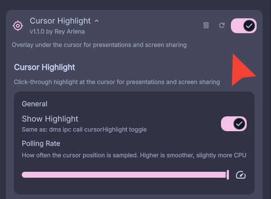
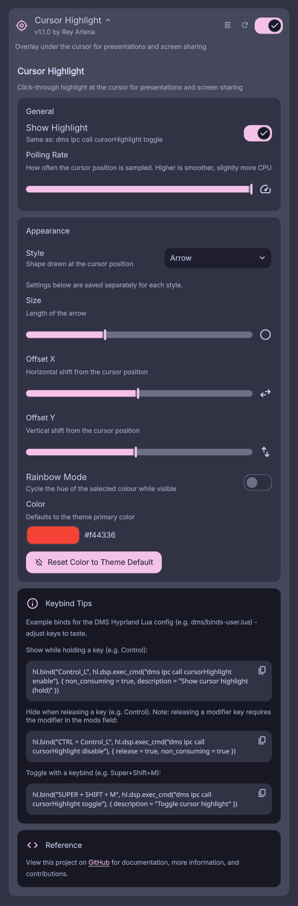

# DMS Plugin: Cursor Highlight

DMS daemon plugin that draws a click-through highlight (ring, dot, or arrow) at the
cursor on an overlay layer. Useful for presentations and screen sharing - the highlight
is a normal Wayland surface, so it is captured by screencopy even when the hardware
cursor is not.



## Requirements

- [DankMaterialShell](https://github.com/AvengeMedia/DankMaterialShell) (DMS)
- Hyprland (cursor position is read from Hyprland's IPC socket)
- `python3` (see [Why the python3 helper?](#why-the-python3-helper))

A startup check verifies both requirements when the plugin is enabled - if Hyprland or python3 is missing, DMS shows an error toast and the plugin refuses to load.

## Install

### From the DMS plugin registry (recommended)

Install straight from within DMS - no manual file management, and updates are one click/command:

- **In-app**: DMS Settings → Plugins → Browse, find *Cursor Highlight*, and install.
- **CLI**: `dms plugins install cursorHighlight`

This clones the plugin into `~/.config/DankMaterialShell/plugins/` and wires it up automatically. Update later with `dms plugins update cursorHighlight`; remove with `dms plugins uninstall cursorHighlight`.

### Manual (git clone)

Clone directly into the plugins directory - the repo root is the plugin (manifest at the top), so no symlink or subfolder juggling:

```bash
git clone https://github.com/ReyArlena/dms-cursor-highlight ~/.config/DankMaterialShell/plugins/cursor-highlight
```

Or clone anywhere and symlink it into the plugins directory:

```bash
ln -s /path/to/dms-cursor-highlight ~/.config/DankMaterialShell/plugins/cursor-highlight
```

Update later with `git -C ~/.config/DankMaterialShell/plugins/cursor-highlight pull`.

### Enable

Either way, finish with: DMS Settings → Plugins → Scan for Plugins → enable Cursor Highlight.

## Usage

### Terminal / IPC

```bash
dms ipc call cursorHighlight toggle
dms ipc call cursorHighlight enable
dms ipc call cursorHighlight disable
```

The settings panel also has a Show Highlight toggle that does the same thing.

### Keybinds

Example binds - adjust keys to taste (also shown with copy buttons in the settings
panel). For DMS's Hyprland Lua config (e.g. `dms/binds-user.lua`):

```lua
-- Show while holding a key (e.g. Control)
-- non_consuming keeps Ctrl working as a normal modifier
hl.bind("Control_L", hl.dsp.exec_cmd("dms ipc call cursorHighlight enable"), { non_consuming = true, description = "Show cursor highlight (hold)" })

-- Hide when releasing the key.
-- Note: releasing a modifier key requires the modifier in the mods field,
-- because the modifier is still active in the event's modifier mask.
hl.bind("CTRL + Control_L", hl.dsp.exec_cmd("dms ipc call cursorHighlight disable"), { release = true, non_consuming = true })

-- Toggle with a keybind (e.g. Super+Shift+M)
hl.bind("SUPER + SHIFT + M", hl.dsp.exec_cmd("dms ipc call cursorHighlight toggle"), { description = "Toggle cursor highlight" })
```

Classic `hyprland.conf` equivalent:

```ini
bind = , Control_L, exec, dms ipc call cursorHighlight enable
bindr = CTRL, Control_L, exec, dms ipc call cursorHighlight disable
bindd = SUPER SHIFT, M, Toggle cursor highlight, exec, dms ipc call cursorHighlight toggle
```

## Settings



DMS Settings → Plugins → Cursor Highlight:

| Setting | Default | Range | Notes |
|---|---|---|---|
| Show Highlight | off | - | Live toggle, same as the IPC command |
| Polling Rate | 60 Hz | 10-240 | How often the cursor position is sampled; higher is smoother, slightly more CPU |
| Style | Ring | Ring / Dot / Arrow | Shape drawn at the cursor |
| Size | 28 px | 8-100 | Radius (ring/dot) or length (arrow) |
| Ring Thickness | 4 px | 1-20 | Ring style only |
| Offset X / Y | 0 px | -100-100 | Shift the highlight from the cursor position |
| Rainbow Mode | off | - | Cycle the hue of the selected colour while visible, keeping its saturation and lightness |
| Flash Speed | 5 | 1-10 | Rainbow cycle speed; 1 is ~10s per cycle, 10 is ~1s (shown when Rainbow Mode is on) |
| Color | theme primary | - | Color picker; reset button restores theme-following default |

Size, Ring Thickness, Offset X/Y, Rainbow Mode, Flash Speed, and Color are saved
separately for each style - switching style switches to that style's own values.

Notes:

- The highlight is click-through (empty input region) and never takes keyboard focus.
- Multi-monitor is handled: the highlight follows the cursor onto whichever screen it is on.
- The arrow's tip sits exactly on the cursor position (plus any offset), angled to
  match the default cursor.
- "Reset Color to Theme Default" deletes the stored color rather than saving the
  current theme color, so the highlight keeps following future theme changes.

## Development

After editing plugin files, restart DMS to pick up the changes:

```bash
dms restart
```

Why: the QML engine caches compiled components by file URL for the lifetime of the
process, and DMS's plugin reload only cache-busts the daemon component
(`CursorHighlight.qml`) - the settings panel (`CursorHighlightSettings.qml`) is loaded
by plain URL and stays cached until the shell restarts. The cache also stores failures:
if the settings file is missing or broken on first open, the panel silently stays empty
on every later attempt until a restart, with nothing in the log.

`dms ipc call plugins reload cursorHighlight` is enough if only `CursorHighlight.qml`
changed; when in doubt, `dms restart`.

## Why the python3 helper?

The plugin polls the cursor position from Hyprland's IPC socket - the same request
`hyprctl cursorpos` makes. A small long-lived python3 process does this instead of a
QML `Socket`, for one reason: log noise.

Hyprland's IPC serves one request per connection and then closes it - the close is the
normal end-of-response marker. Qt, however, reports any connection ending the client
didn't initiate through its error signal (`PeerClosedError`), because it can't know
whether a server hang-up is expected for the protocol. Quickshell then logs every such
error as a warning in C++, before QML code gets a chance to filter it. Polling at 60Hz
from QML therefore floods the Quickshell log with ~60 meaningless warnings per second,
and nothing in QML can suppress them.

The helper sidesteps Qt entirely: at the configured polling rate (60Hz by default) it
opens the socket, sends `cursorpos`, prints the `x, y` reply to stdout, and closes.
The QML side just parses stdout. If Quickshell ever demotes the peer-close warning,
the helper can be replaced with a pure-QML `Socket` + `Timer`. The helper is spawned
once per enable and exits on disable; if it dies (e.g. Hyprland gone), the plugin
disables itself.
